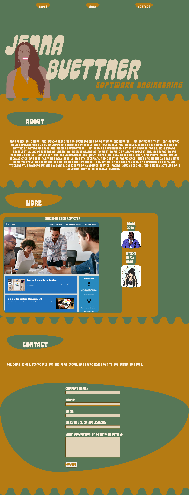

# Jenna Buettner Portfolio

This project's purpose is to create a personal portfolio to represent yourself and your work so that employers may see your skill set and potentially hire you.

## Description

A web application that is responsive and showcases my personal work.

## How to access live web application and project repository

*Live URL: 
*Repository: 

## Visual Overview of application

## Technologies used
HTML, CSS, and git

